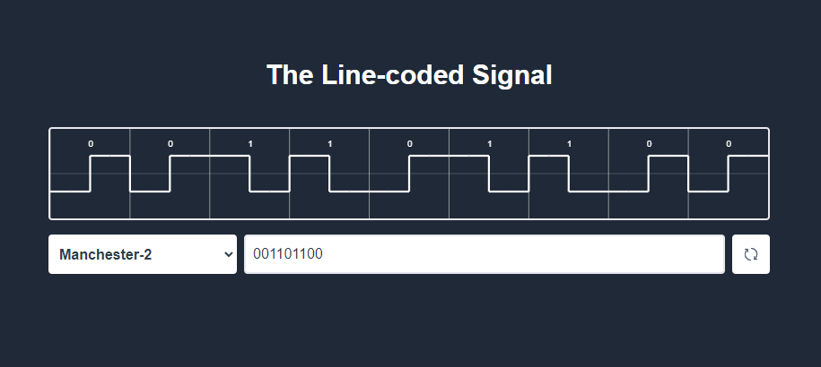

# Todo App

## Table of contents

- [Overview](#overview)
    - [Screenshot](#screenshot)
    - [Links](#links)
- [My process](#my-process)
    - [Built with](#built-with)
    - [Useful resources](#useful-resources)

## Overview

Users are able to:

- Change line code types (Unipolar NRZ, Bipolar NRZ, Unipolar RZ, Manchester-2 and ect.)
- Generate random signals

### Screenshot

### Links

- Live Site URL: [Demo](https://ilyachichkov.github.io/signal_timeline/)

## My process

### Built with

- Semantic HTML5 markup
- CSS custom properties
- Flexbox
- Mobile-first workflow
- [VUE](https://vuejs.org/) - VUE framework
- [TailwindCSS](https://tailwindcss.ru/) - For styles

### Useful resources

- [Google Fonts](https://fonts.google.com/)

